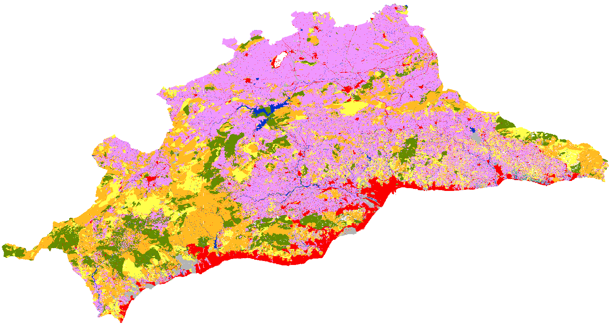
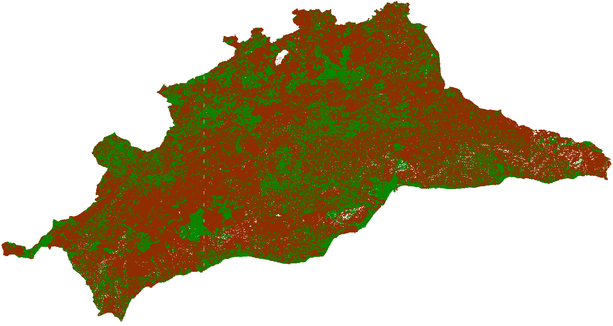
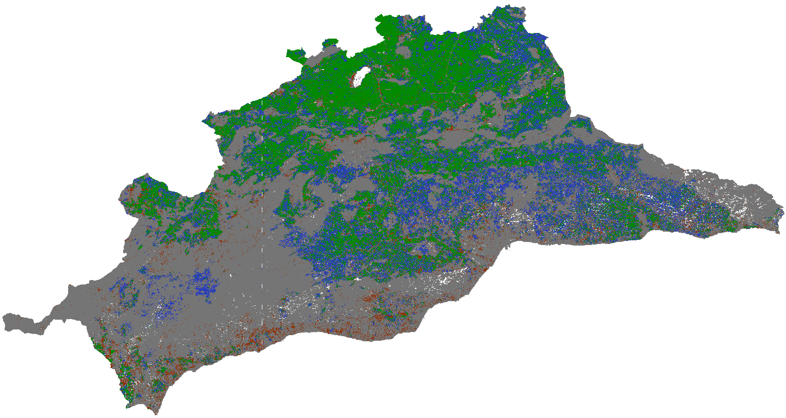

# Automatic land cover validator

  
   


## Overview
Final degree project for University of Malaga at Khaos Research. Author: Jesús Aldana Martín

## Description

This end-of-degree project aims to implement a software tool that allows the validation of land cover classification models in the Iberian Peninsula. With the intention of monitoring the cultivated fields and their distribution, for this we are going to make use of the data of the Geographic Information System of Agricultural Plots (SIGPAC) provided by the Ministry of Agriculture, Fisheries and Food and of free access. With the help of these data and processed satellite images, it will be possible to execute a Python script that obtains an output raster with the new input data and metrics that allow us to measure and validate the performance of the classification model. To test the tool, the entire community of Andalusia will be analyzed, obtaining different analysis rasters and statistical metrics for validation.

### Shapefiles data source

All the shapefiles used in this project have been downloaded from the 'Junta de Andalucía' [geographic informaton data](https://www.juntadeandalucia.es/organismos/agriculturapescaaguaydesarrollorural/servicios/sigpac/visor/paginas/sigpac-descarga-informacion-geografica-shapes-provincias.html).


## Contents

Code functions:

- Reproject rasters
- Merge tiff images
- Create mask from SHP data
- Point in polygon
- Raster comparison
- Validation metrics

## Setup

To run locally the script you just need to install all libraries specified in the requirements.txt. The code below showw how can you do it.

```Python
python3 -m venv <venv_name>

source <venv_name>/bin/activate

python3 pip install -r requirements.txt
```

## Usage

Use all the functions as you wish or run the whole workflow with the launch.sh app. In order to run the script please, replace the <"parameters"> with your own paths.

```Shell
bash launch.sh -r <raster path> -s <shp path> -o <output path> -t <delete tmp>
```

## Testing

The framework used for the unit tests is pytests. In order to run the tests:

```Python
pytest tests/
```

## Output example

### SIGPAC raster

Image raster with the SIGPAC data as the new band values.



### Validation True/False

This raster shows wich pixels are common in both rasters.



### Validation Confusion Matrix

For this image each colour represents the




For extra information check out the [showcase.ipynb](showcase.ipynb) notebook.

## Results

The following table summarizes the results of our analysis for various classes or categories. It provides insights into the number of pixels, correct classifications (aciertos), misclassifications (fallos), and the percentage of accuracy for each class.

| Clase                                | Num Pixeles | Aciertos  | Fallos    | Porcentaje de Acierto |
|--------------------------------------|------------|-----------|-----------|------------------------|
| Citricos Frutal                      | 1069300    | 89403     | 979897    | 8.36                 |
| Citricos                             | 8041756    | 5856071   | 2185685   | 72.82                |
| Citricos-Frutal de cascara           | 8699       | 1545      | 7154      | 17.76                |
| Citricos-Viñedo                      | 2952034    | 2950975   | 1059      | 99.96                |
| Frutal de Cascara-Frutal             | 838815     | 7312      | 831503    | 0.87                 |
| Frutal de Cascara-Olivar             | 279257     | 82857     | 196400    | 29.67                |
| Frutal de Cascara                    | 20177469   | 9080721   | 11096748  | 45.0                 |
| Frutal de Cascara-Viñedo             | 12436      | 3806      | 8630      | 30.6                 |
| Frutal                               | 14711965   | 4774161   | 9937804   | 32.45                |
| Imvernadero y cultivos bajo plastico | 5015050    | 771053    | 4243997   | 15.37                |
| Olivar-Citricos                      | 110703     | 36820     | 73883     | 33.26                |
| Olivar-Frutal                        | 93675      | 30066     | 63609     | 32.1                 |
| Olivar                               | 162620685  | 72449454  | 90171231  | 44.55                |
| Tierra Arable                        | 161368050  | 105376719 | 55991331  | 65.3                 |
| Huerta                               | 1238266    | 570850    | 667416    | 46.1                 |
| Frutal-Viñedo                        | 98892      | 35013     | 63879     | 35.41                |
| Viñedo                               | 2373903    | 1122568   | 1251335   | 47.29                |
| Olivar-Viñedo                        | 147654     | 55533     | 92121     | 37.61                |


This data provides a valuable overview of the performance of our classification system for each class. It can be used for further analysis and decision-making in our project.

---

## The MIT License (MIT)

This project is licensed under the MIT license. See the [LICENSE](LICENSE) file for more info.
